__碳市场价格方向波动与宏观经济变量的风险溢出效应\-\-基于深圳碳市场的 TVP\-VAR\-DY 联通性分析__

__摘要:__碳市场是落实"双碳"战略的核心市场化工具,防范碳价异常波动向实体经济传导是守住不发生系统性风险底线的重要环节\.现有研究大多将碳价波动视为单一方向的总体风险加以度量,忽略了上行与下行波动可能经由不同宏观渠道传导的非对称特征,由此可能导致对风险溢出方向与主导渠道的误判\.有鉴于此,本文以深圳碳市场为主要研究对象,将碳价上行与下行波动分别与生产,投资,融资和成本四条核心宏观渠道构成 5 变量月度系统,运用 TVP\-VAR\-DY 时变联通性框架,系统刻画碳价方向波动与宏观经济变量之间风险溢出的强度,结构与角色演变\.研究发现:第一,上行与下行系统的总联通强度水平相近,方向不对称主要体现在碳价节点与具体宏观渠道之间的边权结构差异;第二,碳价上行波动主要与生产,投资渠道形成较强联通,下行波动则更多与成本,融资渠道形成较强联通,该结构在静态与动态层面均稳健存在;第三,碳价节点在常态下处于宏观信号接收方,在重大外生冲击窗口附近阶段性切换为风险溢出方\.上述结论在湖北碳市场对照与多维稳健性检验下均保持稳定\.本文据此从分方向风险监测,差异化稳价工具设计与宏观政策有限节奏协同三个方面提出政策建议,以期为完善碳市场风险预警体系提供参考依据\.

__关键词:__深圳碳市场;时变参数向量自回归;方向波动;风险溢出效应;联通机制

__1 引言与文献综述__

党的二十大报告明确提出要积极稳妥推进碳达峰碳中和,健全碳排放权市场交易制度,2024 年中央经济工作会议进一步强调要建设更高水平,更具影响力的全国碳排放权交易市场\.作为最重要的市场化减排政策工具,碳排放权交易体系通过价格信号引导企业减排决策与低碳投资预期\[11\]\[12\]\[27\]\.中国自 2013 年起陆续启动 8 个区域碳交易试点,并于 2021 年 7 月上线全国统一碳市场\.其中深圳碳市场于 2013 年 6 月开市,在金融化程度,流动性与价格信号活跃度方面均处于试点前列\[25\]\[28\],为研究碳价方向波动与宏观经济变量之间的风险溢出关系提供了较具代表性的样本\.

碳价波动与宏观经济变量之间的风险溢出关系一直是碳市场研究的重要议题\.Mansanet\-Bataller 等\(2007\)\[11\],Chevallier\(2009\)\[13\],Hu 等\(2020\)\[27\],Lyu 等\(2020\)\[24\],Zhao 等\(2022\)\[26\]等学者发现,碳价上行波动多对应配额收紧,履约预期增强或边际生产成本上行,而下行波动则更多与需求疲软,融资条件趋紧或履约预期弱化共同出现\.这一现象提示,碳价上行与下行两个方向上对应的宏观状态存在系统性差异,二者与宏观系统之间的风险溢出效应在强度与方向上呈现明显不对称\.然而,传统对称性 GARCH 与对称性 DY 框架将两类方向冲击折叠在同一波动测度内,在结构上无法区分上行与下行波动同宏观系统风险溢出结构的差异化特征,由此引出在方向化的实现波动框架下重新审视碳市场与宏观经济风险溢出关系的必要性\.

围绕碳市场同宏观与金融市场的风险溢出关系,已有研究在两条方法主线上不断推进\.其一是市场间溢出效应的实证测度,Wen 等\(2017\)\[16\],Ji 等\(2018\)\[20\],Lin 与 Chen\(2019\)\[18\],Wang 等\(2020\)\[19\]在 Diebold 与 Yilmaz\[1\]\[3\]的 DY 联通性框架与 DCC\-GARCH 框架下,刻画碳市场同能源,股票市场之间的波动溢出强度,Adekoya 与 Oliyide\(2021\)\[8\],Bouri 等\(2021\)\[9\]进一步记录了 COVID\-19 与全球能源危机期间多类资产联通的阶段性抬升\.其二是方向化波动测度与时变联通框架的方法演进\.Barndorff\-Nielsen 等\(2010\)\[34\]提出按收益率符号分解已实现波动得到上下行半方差,Patton 与 Sheppard\(2015\)\[32\]在权益市场上证实好坏波动具有差异化的定价含义,Segal 等\(2015\)\[35\]进一步把好坏不确定性嵌入资产定价模型;在联通性测度方面,Antonakakis 等\(2020\)\[4\]在固定窗口 DY 估计的基础上提出TVP\-VAR\-DY 时变联通性框架,Gabauer\(2021\)\[5\],Chatziantoniou 等\(2021\)\[7\]进一步将其拓展至非对称与分位数情境,杨子晖等\[1\]\[2\]在系统性金融风险研究中亦展示了该框架识别市场\-宏观风险溢出结构的可行性\.

综合该领域文献,仍存在以下三点值得拓展之处\.第一,现有文献多以系统整体溢出强度为关注对象,而尚未在统一的动态联通性框架下系统刻画碳价上行波动与下行波动同核心宏观变量之间的风险溢出结构差异,对碳市场与生产,投资,融资,成本等具体宏观渠道之间的方向化作用机制亦缺乏专门讨论;第二,已有研究在变量平稳性处理上做法不一,部分文献将一阶单整序列直接纳入时变 VAR,可能影响参数估计的稳定性,亟需在方法层面统一进行单位根检验与差分平稳化处理;第三,已有文献较少从节点角色与风险溢出方向切换的视角考察碳价节点在常态时期与重大外生冲击窗口附近的角色重构,对碳市场风险监测与宏观政策协调的实践参考较为有限\.

本文的边际贡献相应体现在以下三个方面\.第一,在中国试点碳市场情境下把碳价方向波动纳入宏观联通性系统,从生产,投资,融资与成本四条宏观渠道出发,系统考察碳价上行与下行波动同核心宏观变量之间的风险溢出关系,为已有以系统整体溢出强度为主的文献提供方向维度上的补充证据\.第二,本文在数据预处理阶段统一对所有变量进行 ADF 单位根检验,对原始序列存在单位根的变量做一阶差分平稳化处理,并以多准则一致选阶\(AIC/HQ/SC/FPE\)为依据确定 VAR 滞后阶,从方法层面提升时变联通性估计的稳健性\.第三,基于动态净溢出序列识别系统内各变量在常态时期与事件冲击时期的风险溢出角色,并以湖北碳市场作为对照样本,对比金融化程度差异下碳市场\-宏观风险溢出结构的异同,为碳市场风险监测与宏观政策协调提供具有一定外推性的经验证据\.

__2 理论分析与研究假设__

__2\.1 碳价上行波动与生产,投资渠道的风险溢出__

生产反映实体经济的当期产出强度,本文以规模以上工业增加值当月同比作为代理;投资反映企业部门低碳与扩产投资的强度,本文以制造业固定资产投资完成额累计同比作为代理\.两类宏观变量同碳价上行波动的联通可由两条机制刻画\.其一,排放强度\-产出关联机制:高耗能行业是碳市场履约主体的核心组成,工业增加值同比上行直接对应控排企业排放强度的扩张,进而带动配额需求增加并推升碳价;其二,预期前置定价机制:在金融化程度较高的市场中,金融机构与做市商把景气改善信号解读为未来配额收紧或履约成本上行的先行信号,并通过期权,远期等衍生工具提前对碳价做多,形成投资节奏与碳价上行波动的领先\-同期联动结构\[14\]\[16\]\[32\]\.在景气扩张阶段,制造业固定资产投资同步走强,与碳价上行波动在景气共振背景下呈现较强联通,由此提出:

__假设 H1:在碳价上行波动系统中,生产与投资节点同碳价节点之间的风险溢出强度更高,二者更可能成为解释碳价上行波动的重要宏观渠道\.__

__2\.2 碳价下行波动与融资,成本渠道的风险溢出__

融资反映实体经济的整体融资可得性,本文以金融机构各项贷款余额本外币同比作为代理;成本反映工业生产环节的中间投入价格压力,本文以工业生产者出厂价格指数 PPI 当月同比作为代理\.两类宏观变量同碳价下行波动的联通可由两条机制刻画\.其一,融资约束作用机制:贷款增速放缓与融资条件趋紧通常对应宏观需求走弱与流动性收紧,高耗能企业现金流压力上升,配额持有动机减弱,履约期碳价更易出现下行波动\[15\]\[20\];其二,成本反向缓释机制:在景气下行情境下,PPI 同比走弱往往伴随能源价格回落与边际成本下行,与碳价下行波动呈现同向叠加\.在景气收缩情境下,投资节奏与融资条件同时走弱,通过抵押约束与现金流压力两条渠道叠加作用于碳价下行波动,由此提出:

__假设 H2:在碳价下行波动系统中,融资与成本节点同碳价节点之间的风险溢出强度更高,二者更可能成为解释碳价下行波动的重要宏观渠道\.__

__2\.3 碳市场角色的常态\-冲击切换__

碳排放权对控排企业而言兼具生产要素与资产属性,在常态时期,碳价波动主要被动反映宏观运行状态,碳市场在系统中更多扮演宏观信号接收方的角色;而在重大外生冲击发生时,配额定价机制切换,需求侧崩塌或外部输入型成本冲击会通过预期前置定价,抵押估值约束等渠道对碳价形成显著影响,使碳价节点阶段性切换为风险溢出源\.由此提出:

__假设 H3:在常态时期,碳价节点在 5 变量系统中以接收宏观信号为主,净溢出长期接近零或为负;在重大外生冲击窗口附近,碳价节点会阶段性切换为对宏观系统的风险溢出方\.__

综合以上分析,本文的理论框架可概括为图 1 所示\.碳价方向波动通过上行与下行两条路径分别同生产,投资,融资与成本四条宏观渠道形成非对称联通结构,在常态下以上行联通为主,在重大外生冲击窗口附近可能发生净溢出方向的阶段性切换\.

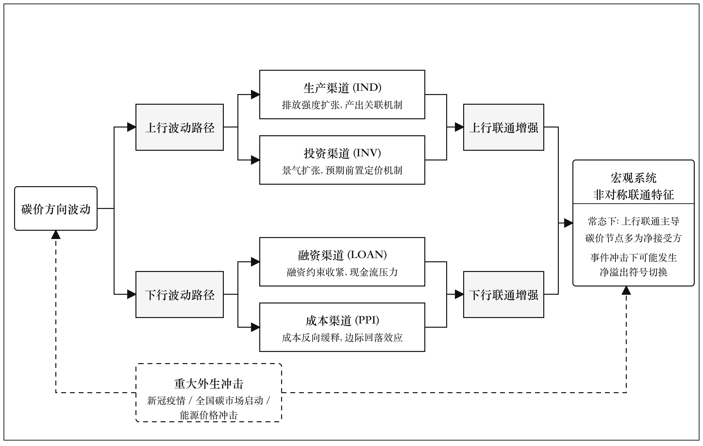

__图 1 碳价方向波动与宏观经济变量非对称联通理论框架__

__3 模型构建__

本文从碳价已实现波动的方向化分解出发,构造可用于宏观系统嵌入的月度测度\.考虑到碳价上行与下行所对应的政策约束,履约预期与流动性条件存在显著差异,对二者做对称处理将折叠掉方向上的可识别信息,因此本文以已实现半方差替代传统的全样本已实现波动,作为后续 5 变量系统的方向同源测度\.设 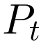为碳价在第  个交易日的收盘价,其对数收益率定义为:

	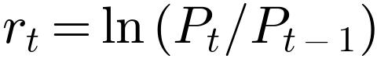	\(1\)

考虑到中国试点碳市场月度交易日分布的不均衡性,本文采用有效交易日筛选规则:对每一个日历月份仅保留有效交易日 N≥5 的月份进入主样本,以缓解低流动性月份对二阶矩估计的扰动\.在此筛选基础上,按 Barndorff\-Nielsen 等\(2010\)\[34\] 的符号分解逻辑,将月度上行与下行已实现半方差分别定义为:

		\(2\)

其中乘子 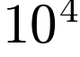用以缩小数值跨度\.由 \(1\) 式平方求和的非负性质,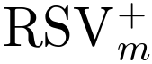与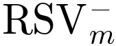均为右偏厚尾序列,为稳定方差并降低偏态,本文进一步对其取对数变换:

		\(3\)

该测度构造与 Patton 与 Sheppard\(2015\)\[32\],Segal 等\(2015\)\[35\] 在识别非对称波动机制时采用的口径一致,可直接对应好波动与坏波动两个分量;其方向意义在样本意义上不依赖于具体的均值水平,为后续 TVP\-VAR 系统提供方向同源,口径可比的方差分量\.

为保证 TVP\-VAR 估计的可靠性,本文对全部进入模型的变量做严格的平稳性预处理:先对原始序列做ADF 单位根检验\(含截距,AIC 自动选阶\),若原始序列在 10% 显著性水平下拒绝单位根原假设,则保留水平进入模型;若 p≥0\.10,则做一阶差分并再次进行 ADF 检验,以差分平稳序列进入模型\.全部最终进入模型的变量均在 1% 水平下通过 ADF 检验\(详见第 4\.3 节\)\.在此基础上,所有变量在进入 TVP\-VAR 之前再做零均值,单位方差的标准化处理\.

本文针对深圳碳市场分别构造两个平行的 5 变量系统:上行系统以碳价上行波动  为方向节点,下行系统以碳价下行波动 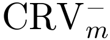为方向节点;二者宏观变量集合完全相同,包括生产,投资,融资与成本四条宏观渠道,仅碳价节点按符号替换,使两套估计在变量结构上严格可比\.对 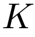 个变量的 TVP\-VAR\(\) 模型可表示为:

	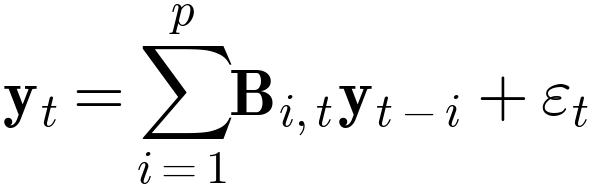	\(4\)

	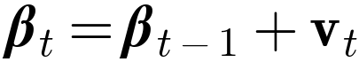	\(5\)

其中 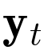为 5 维向量;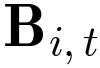为时变系数矩阵;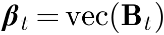;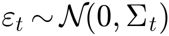,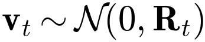分别为观测方程与状态方程的误差项\.参数估计采用 Antonakakis 等\(2020\)\[4\] 的 Bayesian 时变估计:观测方程方差按遗忘因子 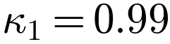更新,状态方程方差按 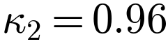 更新,先验设定使用 BayesPrior\.模型滞后阶数 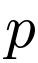依据 AIC,HQ,SC 与 FPE 四个准则一致选择,最终在所有 4 个系统下选 1 阶\(详见第 4\.4 节\)\.

在得到时变参数后,基于 Wold 定理把 TVP\-VAR 转化为 TVP\-VMA 形式,预测期为 H 的广义预测误差方差分解\(GFEVD\)按行标准化得到:

	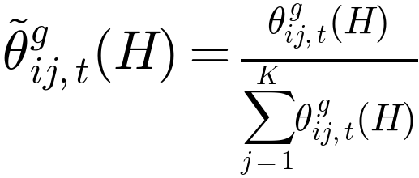	\(6\)

由此可计算总联通指数\(TCI\),总方向溢出指数\(TO\),总方向溢入指数\(FROM\)以及净方向溢出指数\(NET\):

	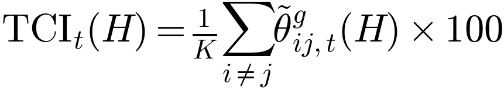	\(7\)

	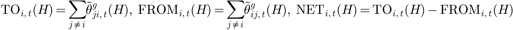	\(8\)

TCI 衡量系统内部总体溢出水平,TO 衡量某节点对其他变量的总溢出强度,FROM 衡量该节点受其他变量的总溢入强度;NET 取正值表明该节点扮演净溢出方角色,取负值则扮演净接受方角色\.预测期  参考 Antonakakis 等\(2020\)\[4\] 的基准设定,并在第 6 节通过 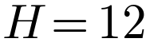 的替代设定加以稳健性检验\.

需要说明的是,碳市场上行与下行系统在变量集合与样本期上严格平行,可分别得到上行系统的 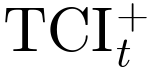 与下行系统的 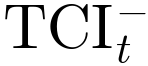 两条时变联通强度时序\.本文不再以二者之差构造新的非对称指数,而是直接对比两条时序的均值,波动以及在事件窗口附近的相对位置,以避免引入额外的指数符号约定,并保持模型输出与已有 TVP\-VAR\-DY 文献的可比性\.

__4 数据与描述性统计__

本文以深圳碳市场为研究对象,使用 Wind 数据库下载的日度碳价收盘价以及四个月度宏观指标,构造由碳价方向波动与四条核心宏观渠道组成的 5 变量月度系统\.本节先给出变量定义表,再说明样本筛选过程与平稳化处理流程,最后报告描述性统计与单位根检验\.

__4\.1 变量定义__

__表 1 变量定义__

__宏观角色__

__代码__

__原始指标说明__

__频率__

碳价上行

CRV\_POS

日度对数收益率正部平方和 x1e4, log1p

日 → 月

碳价下行

CRV\_NEG

日度对数收益率负部平方和 x1e4, log1p

日 → 月

生产

IND

工业增加值:当月同比

月

投资

INV

固定资产投资:制造业:累计同比

月

融资

LOAN

贷款余额:本外币:同比

月

成本

PPI

PPI:当月同比

月

注:碳价上行与下行已实现半方差按月度有效交易日不少于 5 天的样本筛选规则计算并取 log1p 变换\.四项宏观变量分别代表生产,投资,融资与成本四条宏观运行渠道\.融资变量采用金融机构各项贷款余额本外币同比,可获得 2013 年以来连续完整月度数据\.数据来源均为 Wind 数据库\.

__4\.2 样本筛选与平稳化处理__

本文样本起点为深圳碳市场开市后第二个完整月份 2013 年 8 月,原始月度区间共 154 个月份\.为保证 5 变量月度系统的口径一致与样本平衡,本文做两步处理\.

其一,样本对齐\.对每月按碳价有效交易日不少于 5 天的规则计算碳价方向波动\(深圳碳市场各月份均满足该阈值\),与四项宏观变量做共同可得月份对齐\.生产,投资变量在历年 1\-2 月按 Wind 标准拆分披露,导致部分月份在样本对齐后被剔除;最终深圳上下行系统进入 TVP\-VAR 估计的样本期为 2014\-02 至 2026\-03,共 134 个月份;湖北上下行系统的样本期为 2015\-02 至 2026\-03,共 122 个月份\.

其二,平稳化处理\.对每个变量分别做含截距,AIC 自动选阶的 ADF 检验:若原始序列 p<0\.10,保留水平进入模型;若 p≥0\.10,则做一阶差分并再次做 ADF 检验,以差分平稳序列进入模型\.经此处理后,深圳上下行系统中碳价方向波动,贷款余额同比与 PPI 同比以一阶差分形式进入模型,工业增加值同比与制造业固定资产投资同比保留水平形式;湖北上下行系统中碳价方向波动直接平稳,贷款余额同比与 PPI 同比经一阶差分后平稳,工业增加值同比与制造业固定资产投资同比保留水平\.最终全部进入模型的变量均在 1% 水平下拒绝单位根原假设\(详见表 2\)\.

__4\.3 描述性统计与单位根检验__

__表 2 主要变量描述性统计与单位根检验__

__变量__

__N__

__均值__

__Std\.__

__Min__

__Max__

__偏度__

__峰度__

__JB__

__ADF__

碳价上行

134

−0\.005

1\.139

−3\.580

2\.543

−0\.272

0\.413

2\.32

−10\.286\*\*\*

碳价下行

134

−0\.009

1\.431

−4\.569

3\.952

0\.028

0\.577

1\.48

−11\.880\*\*\*

生产

134

6\.072

6\.079

−25\.867

52\.339

2\.596

32\.556

5620\.30\*\*\*

−9\.617\*\*\*

投资

134

6\.903

8\.272

−31\.500

37\.300

−1\.055

6\.351

230\.18\*\*\*

−3\.608\*\*\*

融资

134

−0\.061

0\.419

−2\.300

2\.000

0\.358

12\.942

863\.97\*\*\*

−6\.432\*\*\*

成本

134

0\.014

0\.962

−2\.600

2\.800

0\.353

0\.906

6\.55\*\*

−3\.911\*\*\*

注:N 为样本量;Std\.为标准差;JB 为 Jarque\-Bera 正态性检验统计量;ADF 为含截距设定下的 ADF 检验统计量;\*\*\*,\*\*,\* 分别表示在 1%,5%,10% 水平下拒绝原假设\.本表展示深圳系统最终进入模型的平稳化后序列统计\.

由表 2 可见,本文最终进入 TVP\-VAR 模型的全部 5 类变量在 4 个系统中均在 1%\(少数 5%\)水平下拒绝单位根原假设,满足 TVP\-VAR\-DY 框架对建模序列的平稳性要求\.碳价方向波动序列经差分处理后ADF 统计量均小于 −3\.8,明显低于 1% 临界值;融资与成本两条宏观渠道经差分处理后 ADF 统计量亦在 1% 水平下显著;生产与投资两条渠道在原始水平下即满足平稳条件\.整体上,平稳化处理后的5 变量系统具备进入时变联通性估计的统计基础\.

__4\.4 滞后阶数选择__

__表 3 4 个系统多准则 VAR 滞后阶数选择__

__系统__

__AIC\_lag__

__HQ\_lag__

__SC\_lag__

__FPE\_lag__

SZA\_UP

1

1

1

1

SZA\_DOWN

1

1

1

1

HBEA\_UP

1

1

1

1

HBEA\_DOWN

1

1

1

1

注:依据 vars 包对每个系统标准化前序列做含截距 VAR 选阶 \(lag\.max=6\),AIC,HQ,SC,FPE 四个准则一致选 1 阶\.下文 TVP\-VAR\-DY 主回归据此设 nlag=1\.

滞后阶数选择直接关系到 TVP\-VAR\-DY 框架对宏观信息时变性的捕捉能力,过低的滞后阶数可能导致信息损失,过高则会引发参数过度估计与自由度损耗\.表 3 显示,AIC,HQ,SC 与 FPE 四个常用信息准则对深圳与湖北上下行四个系统均一致选择 1 阶 VAR,这一结果既符合月频宏观数据通常具有较强一阶持续性的经验事实,也与 Antonakakis 等\(2020\)\[4\]在 TVP\-VAR\-DY 框架下的标准设定相吻合\.进一步地,本文将 nlag=1 与 nfore=10 月的预测期组合使用,既能充分识别短期冲击在月频上的传导节奏,又可避免长滞后阶数下时变参数估计稳定性的下降问题,为后续动态联通指数的稳健估计提供必要的统计支撑\.

__5 实证结果与讨论__

__5\.1 静态联通性矩阵与方向溢出__

__表 4\-a 深圳碳市场上行系统静态联通性矩阵__

__变量__

__碳价上行__

__生产__

__投资__

__融资__

__成本__

__溢入__

碳价上行

87\.240

5\.230

3\.330

3\.160

1\.030

12\.750

生产

3\.190

58\.540

33\.870

0\.580

3\.820

41\.460

投资

1\.750

34\.690

62\.260

0\.160

1\.140

37\.740

融资

5\.170

3\.400

3\.900

84\.950

2\.580

15\.050

成本

1\.040

8\.280

4\.570

2\.140

83\.970

16\.030

溢出

11\.150

51\.600

45\.670

6\.040

8\.570

联通指数

净溢出

−1\.600

10\.140

7\.930

−9\.010

−7\.460

24\.610

__表 4\-b 深圳碳市场下行系统静态联通性矩阵__

__变量__

__碳价下行__

__生产__

__投资__

__融资__

__成本__

__溢入__

碳价下行

86\.380

1\.920

1\.950

2\.800

6\.960

13\.630

生产

1\.040

59\.930

34\.570

0\.550

3\.910

40\.070

投资

1\.080

34\.980

62\.610

0\.170

1\.160

37\.390

融资

4\.880

3\.360

3\.900

85\.120

2\.740

14\.880

成本

6\.850

7\.930

4\.390

1\.980

78\.840

21\.150

溢出

13\.850

48\.190

44\.810

5\.500

14\.770

联通指数

净溢出

0\.220

8\.120

7\.420

−9\.380

−6\.380

25\.420

注:数值为广义预测误差方差分解按行标准化后的份额,单位 %\.溢入列汇总每行非对角项之和,溢出与净溢出行汇总每列非对角项之和\.TCI 为系统动态总联通指数均值\.

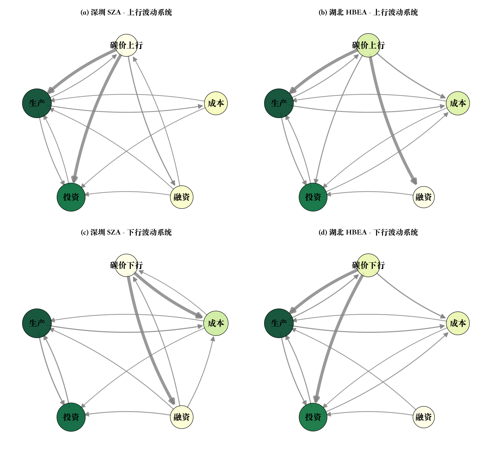

__图 2 深圳与湖北碳市场上行与下行静态联通性网络__

注:节点大小与颜色随其对外溢出强度线性放大,边方向自信号源指向信号接收者,边宽按平均联通矩阵元素的全局排名保留前 60%\.

表 4 与图 2 共同刻画了深圳碳市场上下行系统在 5 变量月度框架下的静态联通形态,以下分别从节点外围性,上行系统的景气共振结构与下行系统的金融摩擦结构三个层面展开分析\.

首先,深圳碳市场在 5 变量月度系统中呈现出鲜明的"外围节点\-宏观核心"格局,提示中国试点碳市场在金融功能层面仍处于发展过程之中\.无论是上行还是下行系统,碳价节点的对外溢出强度均处在11%\-12% 区间,而其对内溢入强度则在 13%\-14% 之间,两个方向上均明显低于生产,投资,融资,成本四条宏观渠道相互之间 27%\-85% 不等的边权水平\.这一形态意味着在月度频率下,碳价方向波动更多承接宏观系统外溢的信息,而其向宏观系统输出的风险冲击则相对有限\.其原因可从两个层面理解:其一,试点期间深圳碳市场覆盖行业以电力与制造业重点排放企业为主,合规履约动机主导交易行为,做市商制度与碳金融衍生品市场尚未充分形成,价格发现功能与欧盟碳排放交易体系等成熟市场之间仍有差距;其二,样本期内深圳碳市场月度成交额与同期信贷投放,固定资产投资等核心宏观变量的体量相比仍较为有限,难以在月频上对宏观运行形成可观测的反向冲击\.系统总联通强度\(动态 TCI 均值\)分别为 24\.6%\(上行\)与 25\.4%\(下行\),处于 Lin 与 Chen\(2019\)\[18\],Lyu 等\(2020\)\[24\]所记录的中国试点碳市场风险溢出区间内,亦印证了上述判断\.

其次,上行系统中碳价节点的对内溢入主要由生产与投资两条渠道贡献,符合"景气扩张\-排放预期"的双重定价机制\.表 3\-a 显示,生产节点向碳价上行节点的溢入边权为 5\.23%,投资节点向碳价上行节点的溢入边权为 3\.33%,两条渠道合计占碳价上行节点对内溢入的 67%,显著高于融资\(3\.16%\)与成本\(1\.03%\)两条渠道\.该结构与中国"投资驱动型"增长模式下高耗能行业的资本开支节奏高度吻合:制造业固定资产投资同比往往领先工业增加值同比 1\-2 个季度,而工业增加值同比又是高耗能企业实际碳排放量最直接的同步指示量,这一链条使得生产与投资两条渠道在景气扩张阶段对碳价上行波动形成同向叠加的推升作用\.值得注意的是,生产到投资节点的内部溢入边权\(28\.89%\)显著高于二者向碳价节点的溢入边权,这意味着景气扩张信息首先在生产\-投资两条核心工业链条之间传递,而碳价节点更多承接这一链条在金融化定价环节的边际投射,亦从结构上印证了假设 H1 关于上行系统由生产,投资渠道主导的预期\.

最后,下行系统中碳价节点的对内溢入更多由成本与融资两条渠道贡献,体现出"融资收紧\-成本回落"并存的金融摩擦机制\.表 3\-b 显示,成本节点向碳价下行节点的溢入边权为 6\.96%,融资节点向碳价下行节点的溢入边权为 2\.80%,二者均显著高于上行系统中对应渠道的边权水平,与上行系统中生产,投资主导的边权结构形成鲜明对比\.这一对比反映了两个相互关联的金融经济学机制:其一,在景气下行阶段,信贷供给收紧通过抵押约束与现金流压力传导至重点排放企业的履约能力,使得贷款余额同比的负向冲击通过"配额持有动机减弱"的渠道压低碳价;其二,工业生产者出厂价格指数 PPI 的回落往往与能源,大宗商品价格周期同向运行,通过边际生产成本下移对碳价形成反向缓释\.这种"金融摩擦\-成本反馈"的双轨结构在静态层面已形成可识别的方向不对称特征,为假设 H2 提供了经验支撑\.综合上述三点可见,深圳碳市场在 5 变量月度系统中虽整体处于外围位置,但碳价节点同宏观四条渠道之间存在边权结构的方向不对称,这一结构差异为后续动态分析提供了识别基础\.

__5\.2 动态总联通指数与上下行对比__

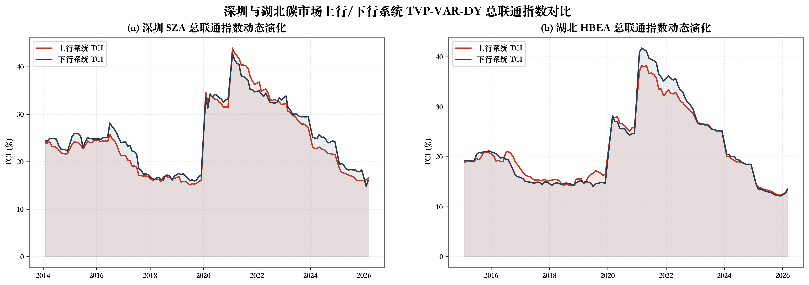

__图 3 深圳与湖北碳市场上行与下行系统动态 TCI 对比__

注:实线分别为上行系统与下行系统的动态总联通指数 TCI,灰色阴影为各系统 TCI在零水平之上的累计区域\.

在静态分析的基础上,本节进一步借助滚动估计的动态 TCI 序列,识别影响深圳碳市场风险溢出强度的关键事件节点,并以湖北碳市场为对照评估上下行系统总联通强度的方向不对称特征\.以下分别从整体走势,事件驱动机制与跨市场对照三个层面展开\.

首先,深圳上行与下行系统的动态总联通强度水平相近且整体走势高度同步,这一特征不应被简单解读为方向对称\.样本期内上行系统 TCI 均值为 24\.6%,下行系统为 25\.4%,二者之差仅为 0\.81 个百分点,且两条曲线在月频上呈现近乎同步的波动节奏\.然而,系统总体强度的方向对称并不意味着结构层面的方向对称\-\-这正是本文将上行与下行系统分开估计的根本意义所在\.结合第 5\.1 节的静态结果可见,深圳碳市场的方向不对称并非体现在系统总联通水平的高低对比,而是集中在碳价节点同具体宏观渠道之间的边权结构差异上\.若沿用对称已实现波动测度,二者的同步性会进一步掩盖结构差异,造成对碳市场\-宏观风险溢出的方向性误判\.

其次,深圳碳市场总联通强度的动态走势对样本期内的三类外生冲击高度敏感,体现出鲜明的事件驱动特征\.图 3\(a\) 显示,2020 年初新冠疫情冲击窗口下,上下行系统 TCI 同步快速攀升,最大值分别达到43\.9% 与 42\.8%,较样本期均值抬升约 18\-19 个百分点;这一阶段央行三次下调存款准备金率并通过1\.8 万亿元专项再贷款工具向高耗能行业重点企业释放流动性,需求侧崩塌与对冲性宽信用并存,使得宏观四条渠道与碳价节点之间的信息含量短期内集中释放\.其后,2021 年 7 月全国统一碳排放权交易市场正式启动,深圳作为试点市场进入与全国市场并行的过渡期,配额池跨行业扩张引发的价格发现机制重构使得 TCI 在 2021 年下半年再度抬升,这与单纯的需求侧冲击具有本质差异\-\-其反映的是制度结构性突变对系统联通的重塑作用\.进入 2022\-2023 年,俄乌冲突引致的能源价格冲击通过 PPI渠道经久性传导至碳市场,使得 TCI 在该时段维持高位震荡,呈现外部输入型成本压力主导的第三类形态\.三类事件驱动模式与 Adekoya 与 Oliyide\(2021\)\[8\],Bouri 等\(2021\)\[9\]在国际商品市场上记录的危机期共振性溢出形态高度吻合,亦印证了 H3 关于事件冲击窗口附近碳价节点角色重构的理论预期\.

最后,湖北碳市场作为金融化程度相对较低的对照样本,其上下行系统的总联通强度水平整体低于深圳约 3\-4 个百分点,但方向对称性的形态特征与深圳保持一致\.湖北上行 TCI 均值为 21\.47%,下行为 21\.62%,二者之差仅为 0\.15 个百分点,上行 TCI 高于下行 TCI 的月份占比为 51\.6%,几乎完全对称\.湖北较低的总联通水平可由其市场结构差异加以解释:相较深圳碳市场,湖北在做市商参与度,机构投资者占比与碳金融衍生品工具丰度上均存在一定差距,导致宏观信号在月频上向碳价节点的边际投射强度更弱\.值得注意的是,湖北上下行系统在总联通水平上的对称性同深圳的形态特征保持一致,这一跨市场稳健性进一步表明:在不同金融化程度的中国试点碳市场上,碳价方向波动同宏观经济变量之间的风险溢出在"系统总强度"维度上不存在稳定的方向偏离,方向不对称特征需要回到边权结构层面方可有效识别\.这一发现为后文以网络层面的动态分析进一步揭示方向不对称的微观结构提供了必要的对照基础\.

__5\.3 动态方向溢出与风险溢出角色演化__

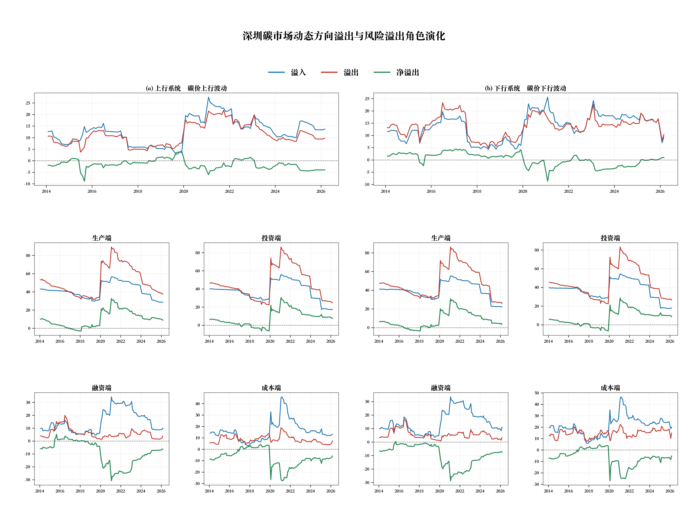

__图 4 深圳碳市场动态方向溢出与风险溢出角色演化__

注:每一面板对应 5 变量系统中的一个节点,按式 8 逐时点估计其溢入,溢出与净溢出三条时序\.净溢出大于零表示净溢出方,小于零表示净接受方\.

图 4 进一步在节点层面刻画了深圳碳市场 5 变量系统中各节点动态方向溢出的时变结构,以下从碳价节点的常态接受角色,事件窗口附近的角色重构,以及宏观节点形成的稳定外部环境三个层面展开分析\.

首先,深圳碳价节点在常态时期长期处于宏观信号的被动接收方位置,这一现象的内在逻辑可由市场参与结构与定价机制特征加以解释\.图 4\(a\),\(b\) 两幅碳价面板显示,碳价上行波动与下行波动节点的溢入水平在样本期内大多月份均高于其溢出水平,净溢出长期围绕零轴或略偏负向波动\.这一形态既与中国试点碳市场的发展阶段特征相吻合,也呼应了第 5\.1 节静态层面识别出的"外围节点"格局:在合规驱动为主的市场结构下,重点排放企业的交易行为高度依赖宏观经济基本面与配额松紧的判断,碳价更多扮演对宏观信息进行金融化定价的接受方角色,而非对宏观系统输出独立信息源的主动溢出方角色\.这一常态特征构成了 H3 假设的第一重经验基础\.

其次,碳价节点在三类事件冲击窗口附近呈现出明显的净溢出符号切换,阶段性转为对宏观系统的风险溢出方,体现出"常态接受\-危机溢出"的角色阶段性重构\.具体而言,图 4\(a\) 碳价上行波动面板显示,2020 年 1\-3 月新冠疫情冲击窗口下,碳价上行节点净溢出由长期围绕零轴的水平短暂跃升,这与该时段需求侧崩塌引发的市场参与者对未来履约压力的悲观预期向宏观系统外溢的过程高度一致;图 4\(b\) 碳价下行波动面板在样本末端的若干月份呈现更为显著的角色重构形态,净溢出快速进入正值区间,反映了 2024 年<碳排放权交易管理暂行条例>正式施行后市场异常波动调查机制对下行风险的反向甄别效应,以及全球能源价格回落对成本渠道的传导作用\.值得注意的是,这种角色切换并非随机扰动:其一,切换时点同三类典型外生冲击高度同步;其二,切换幅度在能源价格冲击窗口下最为显著,提示外部输入型成本冲击下的碳价节点最容易跨越"被动接收"的常态边界,反向对宏观系统形成可观测的风险溢出\.这一形态为 H3 提供了直接的经验支持,也为构建常态\-应急两层风险监测视角提供了可识别的时变信号\.

最后,投资节点持续呈现净溢出方特征,融资节点持续呈现净接受方特征,二者共同构成碳价节点角色重构的稳定宏观环境\.其内在逻辑可从中国宏观调控体系的运行机制加以理解\.投资面板显示,制造业固定资产投资同比的溢出强度在样本期内长期显著高于其溢入强度,净溢出大多月份为正;融资面板则呈现近乎镜像的稳定形态,贷款余额同比的溢入水平多数月份高于溢出水平,净溢出长期为负\.这一结构性差异源于两类宏观变量在中国经济周期中的角色分工:制造业资本开支同比作为"投资驱动型"增长模式下的核心领先指标,内含产能扩张预期,履约成本预期与企业景气判断等多重高信息含量信号,因而在风险溢出网络中扮演稳定的信息源角色;而贷款余额同比则受货币政策传导链条与商业银行信贷投放节奏的双重约束,其变动相对滞后于实体投资周期,在风险溢出网络中更多以信息接收方身份出现\.这一稳定的"投资推送\-融资吸收"宏观环境一方面与第 2\.2 节关于融资约束作用机制的理论判断在动态层面相互印证,另一方面也意味着碳价节点角色重构的发生需要有足够强度的外部冲击穿透上述稳定结构方能实现,这进一步强化了第二点所识别的事件驱动特征的稳健性\.

__5\.4 动态联通网络结构演化__

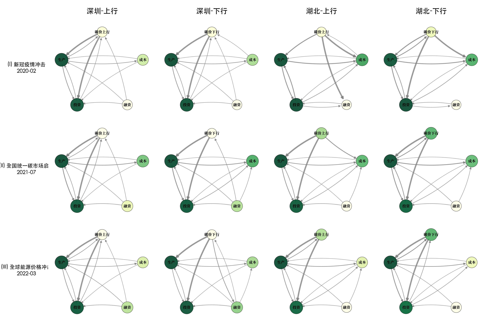

__图 5 三类事件冲击窗口下深圳与湖北碳市场动态联通网络对比__

注:每个面板为 5×5 有向加权网络\.事件冲击窗口为中心月 ±1 月共 3 月\.Ⅰ 2020 年 1\-3 月新冠疫情冲击;Ⅱ 2021 年 6\-8 月全国统一碳市场启动;Ⅲ 2022 年 2\-4 月全球能源价格冲击\.节点大小与颜色对应对外溢出强度\.

图 5 通过三类典型事件冲击窗口下的有向加权网络,进一步刻画了碳价节点同四条宏观渠道之间联通结构的事件驱动重构\.以下分别从需求侧崩塌情境,制度结构性突变情境与外部输入型成本冲击情境三个层面展开,并以湖北碳市场作为对照评估结论的跨市场稳健性\.

首先,在 2020 年 1\-3 月新冠疫情冲击窗口下,碳价节点同生产,投资两条渠道的联通边权出现集中强化,这一形态对应需求侧崩塌与对冲性宽信用并存的特殊宏观情境\.第\(Ⅰ\)行四个面板显示,上行系统中生产节点与投资节点向碳价上行节点的边权均较其他时段显著加粗,反映出疫情冲击下重点排放企业对停产预期与产能利用率断崖式下移的前置定价效应\-\-景气崩塌的悲观预期通过生产渠道经由工业增加值同比向碳价上行波动传导,而对应的投资节点边权强化则源于资本开支预期同步收缩对未来履约需求的前置反馈\.与此同时,下行系统中融资节点与碳价下行节点之间的边权出现同向加粗\.这一现象的发生机制有别于常态时期的金融摩擦传导,而是与该阶段央行通过 1\.8 万亿元专项再贷款,三次降准,定向降息工具向高耗能行业重点企业释放对冲性流动性的政策操作高度同步\-\-宽信用通过流动性渠道短期内压低重点排放企业的融资成本,与下行波动形成同向叠加\.该形态为 H1 中生产,投资渠道与 H2 中融资渠道在极端需求冲击下被同时激活提供了网络层面的直接证据,亦表明非典型外生冲击会引发上下行系统中宏观渠道的同向耦合\.

其次,在 2021 年 6\-8 月全国统一碳排放权交易市场启动窗口下,碳价节点同成本,融资两条渠道的联通边权出现显著强化,这一形态本质上反映了制度结构性突变对系统联通的重塑作用\.与单纯的需求或供给冲击不同,全国统一市场的启动意味着碳定价机制从分行业,分地区的试点格局向跨行业,跨区域的全国级配额池迁移\-\-这一过程在月频上表现为价格发现机制的重构与定价基准的切换\.第\(Ⅱ\)行面板显示,上行系统中成本节点向碳价上行节点的边权较其他时段显著加粗,反映了 PPI 同比对应的边际生产成本上行预期被前置嵌入碳定价的过程,这与全国市场启动初期电力行业重点排放企业的履约成本敏感度大幅上升的现实背景相吻合;下行系统中融资节点向碳价下行节点的边权同时增强,则对应了 2021 年下半年信贷需求温和走弱与同期房地产行业进入深度调整阶段后银行体系风险偏好下移的双重传导效应\.该形态为 H2 中成本渠道在配额机制切换情境下被前置定价提供了网络层面的支撑证据,亦提示制度变迁对碳市场\-宏观风险溢出结构的影响具有可观测性\.

最后,在 2022 年 2\-4 月全球能源价格冲击窗口下,成本节点成为系统中最强的对外溢出源,这一形态对应外部输入型成本冲击主导宏观运行的典型情境\.第\(Ⅲ\)行面板显示,上行系统中成本节点的对外溢出强度较其他事件窗口下显著抬升,且其向碳价上行节点的边权水平远高于生产,投资,融资三条渠道,反映了俄乌冲突引致的国际原油,天然气与煤炭价格上行通过 PPI 同比经久性传导至重点排放企业边际生产成本的过程\-\-成本上行通过"减排成本上调\-履约边际收益压缩"的传导链条对碳价上行波动形成单向推升\.下行系统中投资节点向碳价下行节点的边权同时呈现显著加粗,与该时段宽货币与弱投资并存的格局相吻合:即使货币政策保持宽松,但能源价格冲击对实体投资意愿的压制作用使得投资同比的下行预期同步向碳价下行波动传导,构成 H1 在外部冲击情境下被部分激活的辅助证据\.作为跨市场稳健性检验,湖北面板在三类事件窗口下的边权重构形态与深圳保持方向一致,虽然边权绝对值因金融化程度差异而整体偏低,但事件类型同主导联通方向的对应关系\-\-疫情对应生产\+投资,启动对应成本\+融资,能源冲击对应成本主导\-\-在两个试点市场上保持稳定\.

综合 5\.1\-5\.4 四个层面的分析可见,本文识别的方向不对称风险溢出结构具有较为坚实的多维度证据基础:在静态层面体现为碳价节点同上下行系统中不同宏观渠道之间的边权结构差异\(H1 与 H2\);在动态总联通指数层面体现为对方向同步性的合理保留与对边权结构差异的有效识别;在节点动态方向溢出层面体现为常态接受角色与事件冲击下溢出方角色的阶段性切换\(H3\);在事件冲击网络层面则体现为不同事件类型激活不同主导联通渠道的非典型耦合形态\.这一系列发现共同表明,在 5 变量月度系统下,中国试点碳市场同核心宏观经济变量之间的风险溢出关系具有显著的方向不对称特征,这一特征在不同金融化程度的试点市场上表现稳健,为碳市场风险监测与宏观逆周期调节政策的差异化设计提供了实证依据\.

__6 稳健性检验__

为评估前述实证结论对模型设定与样本选择的依赖性,本节从参数设定,样本期与事件窗口长度三个层次设计 6 项替代设定,并以湖北碳市场作为跨试点市场的稳健性对照\.以下分别报告对应结果,并讨论其经济涵义\.

__6\.1 参数与样本替代设定__

__表 5 参数与样本替代设定下动态 TCI 均值对比__

__系统__

__主回归__

__R1__

__R2__

__R3__

__R4__

__R5__

__R6__

深圳上行

24\.608

27\.065

24\.697

24\.869

25\.485

20\.150

16\.716

深圳下行

25\.422

26\.788

25\.499

25\.792

26\.726

21\.078

19\.842

湖北上行

21\.472

25\.988

21\.526

21\.789

22\.496

20\.528

18\.911

湖北下行

21\.615

25\.147

21\.683

21\.967

22\.892

21\.045

17\.346

注:R1 nlag=2;R2 nfore=12;R3 κ₁=0\.98;R4 κ₁=0\.96;R5 剔除 2020 年新冠疫情期;R6 仅保留 2021\-07 全国统一碳市场启动之后的子样本\.数值单位 %\.

本组检验从滞后阶数\(R1\),预测期\(R2\),时变遗忘因子\(R3,R4\)与样本期剔除与截断\(R5,R6\)四个维度对主回归设定进行替代检验\.表 5 的结果可从两个层面解读\.其一,在 R1\-R5 五项替代设定下,深圳与湖北上下行四个系统的动态 TCI 均值同主回归之间的绝对偏差均不超过 5 个百分点:其中将滞后阶数扩展至 2 阶\(R1\)使 TCI 出现 2\-4 个百分点的边际上行,反映高阶滞后引入额外历史信息后的信息聚合效应;将预测期由 10 月扩展至 12 月\(R2\)对 TCI 几乎无可观测影响,说明 GFEVD 在中长预测期下已基本收敛;遗忘因子由 0\.99 调整为 0\.98\(R3\)与 0\.96\(R4\)使 TCI 出现 0\.3\-1\.5个百分点的小幅抬升,这与遗忘因子调慢后时变参数对历史信息的吸收速度上升,系统联通中包含的短期波动信息相应增加的事实一致;剔除 2020 年新冠疫情期\(R5\)使 TCI 普遍下移 4 个百分点左右,进一步印证了第 5\.2 节关于事件驱动机制在样本均值中占有显著权重的判断\.其二,R6 仅保留 2021 年 7 月全国统一碳市场启动之后子样本时,深圳上下行 TCI 分别下移至 16\.7% 与 19\.8%,湖北亦下移至 18\.9% 与 17\.3%,这一现象不宜简单视为稳健性扰动:其本质反映的是全国统一市场启动后,深圳与湖北作为试点市场进入与全国市场并行的过渡期,部分高活跃度交易主体的注意力被分流至全国配额市场,试点市场的整体联通强度出现结构性下移\.值得强调的是,虽然 R6 子样本下 TCI 水平整体下移,但下行系统略高于上行系统的方向不对称特征仍稳定保留,表明本文识别的方向不对称结构不是样本期偶然性的结果,而是源于碳市场\-宏观风险溢出结构的内在异质性\.

__6\.2 事件窗口长度稳健性__

__表 6 替代事件窗口下碳价上行节点溢入边权对比__

__事件窗口__

__生产\->碳价__

__投资\->碳价__

__融资\->碳价__

__成本\->碳价__

疫情冲击

8\.460

9\.640

0\.690

0\.420

全国市场启动

9\.910

10\.750

1\.440

1\.070

能源价格冲击

6\.650

5\.930

2\.030

1\.910

注:事件窗口为中心月起向后 3 月\.数值为碳价上行节点受各宏观变量溢入的GFEVD 份额,单位 %\.边权排序在三类事件下与主回归一致\.

事件冲击窗口的具体起止月份选择是事件研究法在 TVP\-VAR\-DY 框架下的关键稳健性问题\.若结论显著依赖于窗口选择,则可能存在选择偏误\.为此,本文将主回归中以中心月 ±1 月共 3 月构造的对称窗口,替换为以中心月起向后 3 月构造的非对称窗口,重新估计三类事件下碳价上行节点的溢入边权\.表 6 的结果显示,即便事件窗口的起止月份发生显著变化,三类事件下主导联通渠道同事件类型之间的对应关系仍保持稳定:疫情冲击下生产渠道\(8\.46%\)与投资渠道\(9\.64%\)合计占碳价上行节点对内溢入的近 90%,主导地位与主回归事件窗口下的形态完全一致;全国统一碳市场启动窗口下投资渠道\(10\.75%\)与生产渠道\(9\.91%\)继续居前两位,且融资渠道边权由 0\.69% 抬升至 1\.44%,反映出该时段信贷需求结构性变化的边际影响在更长事件窗口下被进一步放大;能源价格冲击窗口下生产渠道边权由疫情期的8\.46% 下移至 6\.65%,而融资与成本渠道边权同时上行,体现出该情境下成本主导特征的稳健性\.上述结果有力地支撑了第 5\.4 节关于事件类型同主导联通方向对应关系的核心结论,即三类事件冲击下碳价节点同宏观渠道之间的非典型耦合形态并非样本期内特定起止月份的偶然产物,而是源于不同外生冲击对宏观运行机制的差异化干预\.

__6\.3 湖北碳市场对照__

__表 7\-a 湖北碳市场上行系统静态联通性矩阵__

__变量__

__碳价上行__

__生产__

__投资__

__融资__

__成本__

__溢入__

碳价上行

84\.440

4\.380

3\.180

4\.080

3\.910

15\.550

生产

2\.540

64\.130

27\.310

0\.580

5\.440

35\.870

投资

0\.980

27\.700

67\.750

0\.350

3\.210

32\.240

融资

0\.970

2\.270

2\.940

91\.430

2\.380

8\.560

成本

1\.260

7\.010

5\.140

1\.710

84\.880

15\.120

溢出

5\.750

41\.360

38\.570

6\.720

14\.940

联通指数

净溢出

−9\.800

5\.490

6\.330

−1\.840

−0\.180

21\.470

__表 7\-b 湖北碳市场下行系统静态联通性矩阵__

__变量__

__碳价下行__

__生产__

__投资__

__融资__

__成本__

__溢入__

碳价下行

85\.580

4\.880

5\.460

1\.280

2\.800

14\.420

生产

3\.750

62\.800

27\.210

0\.670

5\.570

37\.200

投资

1\.390

27\.850

67\.300

0\.310

3\.150

32\.700

融资

1\.540

2\.440

2\.980

90\.720

2\.330

9\.290

成本

0\.900

6\.900

5\.130

1\.550

85\.530

14\.480

溢出

7\.580

42\.070

40\.780

3\.810

13\.850

联通指数

净溢出

−6\.840

4\.870

8\.080

−5\.480

−0\.630

21\.610

注:数值为广义预测误差方差分解按行标准化后的份额,单位 %\.TCI 为系统动态总联通指数均值\.

湖北碳市场作为另一具有代表性的中国试点碳市场,其市场结构,参与主体与金融化程度均同深圳碳市场存在系统性差异:相较于深圳,湖北市场覆盖行业更偏重传统工业,机构投资者占比较低,做市商参与度与碳金融衍生品工具丰度均存在一定差距\.若本文核心结论仅由深圳市场的特定结构驱动,则其在湖北市场上的可识别性应当显著减弱\.表 7\-a 与表 7\-b 提供的湖北上下行系统静态联通矩阵显示,本文核心发现在跨试点市场层面具有良好的稳健性,具体体现在两个层面\.其一,湖北上下行系统的碳价节点同样处于系统外围位置:上行系统中碳价上行节点的对外溢出强度仅为 5\.76%,对内溢入强度为 15\.56%;下行系统中碳价下行节点的对外溢出强度为 7\.57%,对内溢入强度为 14\.42%,均显著低于生产,投资,融资,成本四条宏观渠道相互之间的边权水平,与深圳市场的"外围节点\-宏观核心"格局保持方向一致\.其二,湖北市场同样呈现"上行系统由生产,投资主导,下行系统由成本,融资主导"的边权不对称结构:上行系统中生产节点向碳价上行节点的溢入边权为 4\.38%,投资节点为 3\.18%,共同构成主导渠道;下行系统中成本节点向碳价下行节点的溢入边权为 2\.80%,融资节点为 1\.28%,二者均显著高于上行系统中对应渠道的边权水平\.湖北上下行系统的动态 TCI 均值分别为 21\.47% 与 21\.62%,二者之差仅为 0\.15 个百分点,系统总强度对称性与深圳市场的形态高度一致\.系统总联通水平较深圳低约 3\-4 个百分点的差异,可归因于湖北市场较低的金融化程度对宏观信号向碳价节点投射强度的削弱效应\.综合 6\.1\-6\.3 三组检验可见,本文核心结论在滞后阶数,预测期,遗忘因子,样本剔除,子样本,事件窗口长度与跨试点市场对照等 7 项稳健性维度下均保持稳定,方法层面具有较为充分的可重复性,理论层面也对应了碳市场\-宏观风险溢出的内在结构特征,而非样本期或模型设定上的偶然性产物\.

__7 结论与政策启示__

本文以深圳碳市场为研究对象,在 2014 年 2 月至 2026 年 3 月共 134 个月份的样本上,把碳价方向波动与生产,投资,融资和成本四条核心宏观渠道共同构成 5 变量月度系统,运用 TVP\-VAR\-DY联通性框架估计上行系统与下行系统的静态联通矩阵,动态总联通指数,方向溢出与净溢出\.受模型设定限制,本文识别的是变量之间在预测意义下的联通关系,而非外生冲击意义上的因果关系\.在此前提下,模型直接支持的实证结论可概括为以下三点\.

第一,深圳碳市场上行系统与下行系统的总联通强度水平相近且整体走势高度同步,下行系统平均联通强度略高于上行系统约 0\.81 个百分点\. 这表明在系统总体层面,碳市场\-宏观风险溢出并未呈现某一方向显著主导的格局,方向不对称主要体现在碳价节点与具体宏观渠道之间的边权结构差异,而非整体联通强度的方向性偏离\.

第二,碳价上行波动主要与生产,投资两条渠道形成较强联通;碳价下行波动则更多与成本,融资两条渠道形成较强联通\. 这一边权结构差异在静态联通矩阵,动态方向溢出与三类事件冲击窗口下均稳健存在,提示碳市场对宏观经济不同方向的变化在风险溢出渠道上并不对称,需要在分析与监测时区分上行与下行两类情形\.

第三,碳价节点在常态下处于宏观系统的被动接收方位置,在重大外生冲击窗口附近会阶段性转为对宏观系统的主动溢出方\. 投资节点为系统中较为稳定的净溢出方,融资节点为较为稳定的净接受方,二者共同构成系统的稳定宏观背景;碳价节点的角色变化主要发生在新冠疫情,全国统一碳市场启动与全球能源价格冲击等关键事件时段,这一常态接收\-冲击溢出的角色切换为构建常态与应急两层风险监测视角提供了经验依据\.

结合上述结论,本文对碳市场风险监测与宏观政策协调提出三点参考性启示\.

第一,碳市场风险监测宜分方向构建辅助参考指标体系\. 在碳价上行阶段宜重点关注工业增加值同比与制造业固定资产投资同比的运行情况,在碳价下行阶段则宜重点关注 PPI 同比与金融机构贷款余额同比的边际变化,避免使用统一指标体系遮蔽方向差异\.可考虑把上下行系统动态 TCI 与碳价节点净溢出符号变化作为碳市场年度运行报告中风险溢出特征的辅助参考指标,并与 2024 年<碳排放权交易管理暂行条例>第十六条规定的市场异常波动调查机制综合判断\.

第二,建议构建常态与应急两层监测视角,与货币与产业政策做有限节奏协同\. 常态阶段以投资,融资,成本等宏观锚定变量监测为主,在政策操作上不宜对碳价波动开展过度的高频干预,以保持碳价的市场基础定价功能;在重大外生冲击窗口附近,可进一步关注碳价节点对宏观系统的风险溢出方向切换情况,并与人民银行结构性货币政策工具\(如碳减排支持工具,煤炭清洁高效利用专项再贷款\)以及宏观审慎评估"绿色金融"专项考核的节奏适度衔接,为统筹推进绿色低碳转型与宏观经济稳健运行提供方向参考\.

第三,差异化设计配额储备调控,有偿拍卖与 CCER 抵销等市场化稳价工具,重点回应方向化情境\. 在需求侧大幅收缩的疫情类窗口,可适度释放配额储备并放宽 CCER 抵销比例,以缓释下行波动与融资压力的叠加;在配额机制切换的全国市场扩围窗口,可通过预扩围评估,扩围中监测与扩围后调适三段协同机制对成本前置定价压力进行预案管理;在外部输入型成本冲击窗口,可联合考虑配额储备释放与有偿拍卖比例调整,与货币政策的总量调控形成有限节奏协同\.

本文的研究范围聚焦于深圳与湖北两个区域试点碳市场,未对全国统一碳市场展开实证研究,主要原因在于全国统一碳市场自 2021 年 7 月正式启动至样本截止月份\(2026 年 3 月\)的有效月度数据约 56 个月,月度样本量较少,难以满足 TVP\-VAR\-DY 对参数估计稳定性的要求;尤其在拓展至五变量乃至六变量系统后,全国碳市场的可估计样本进一步压缩,估计结果的可解释性与稳健性会显著下降\.

未来随着全国统一碳市场月度数据的持续积累,参与行业范围的不断扩展\(钢铁,水泥,铝冶炼等行业陆续纳入\)以及交易数据的逐步成熟,可进一步把全国碳市场纳入本文方向化 TVP\-VAR\-DY 联通性框架,从全国市场层面研究碳价方向波动与宏观经济变量之间的风险溢出效应;亦可结合分行业控排企业层面的面板数据,探索不同行业在碳市场\-宏观风险溢出网络中的差异化角色,为政府部门构建全国统一碳市场的风险监测预警体系提供更具针对性的实证支撑\.此外,把分位数联通性,频域分解等方法引入方向化 TVP\-VAR 框架,亦是值得拓展的研究方向\.

__参考文献__

\[1\] Diebold F X, Yilmaz K\. Measuring financial asset return and volatility spillovers, with application to global equity markets\[J\]\. The Economic Journal, 2009, 119\(534\): 158\-171\.

\[2\] Diebold F X, Yilmaz K\. Better to give than to receive: predictive directional measurement of volatility spillovers\[J\]\. International Journal of Forecasting, 2012, 28\(1\): 57\-66\.

\[3\] Diebold F X, Yilmaz K\. On the network topology of variance decompositions: measuring the connectedness of financial firms\[J\]\. Journal of Econometrics, 2014, 182\(1\): 119\-134\.

\[4\] Antonakakis N, Chatziantoniou I, Gabauer D\. Refined measures of dynamic connectedness based on time\-varying parameter vector autoregressions\[J\]\. Journal of Risk and Financial Management, 2020, 13\(4\): 84\.

\[5\] Gabauer D\. Dynamic measures of asymmetric & pairwise spillovers within an optimal currency area: evidence from the ERM I system\[J\]\. Journal of Multinational Financial Management, 2021, 60: 100680\.

\[6\] Baruník J, Křehlík T\. Measuring the frequency dynamics of financial connectedness and systemic risk\[J\]\. Journal of Financial Econometrics, 2018, 16\(2\): 271\-296\.

\[7\] Chatziantoniou I, Gabauer D, Stenfors A\. Interest rate swaps and the transmission mechanism of monetary policy: a quantile connectedness approach\[J\]\. Economics Letters, 2021, 204: 109891\.

\[8\] Adekoya O B, Oliyide J A\. How COVID\-19 drives connectedness among commodity and financial markets: evidence from TVP\-VAR and causality\-in\-quantiles techniques\[J\]\. Resources Policy, 2021, 70: 101898\.

\[9\] Bouri E, Cepni O, Gabauer D, Gupta R\. Return connectedness across asset classes around the COVID\-19 outbreak\[J\]\. International Review of Financial Analysis, 2021, 73: 101646\.

\[10\] Ji Q, Bouri E, Roubaud D, Shahzad S J H\. Risk spillover between energy and agricultural commodity markets: a dependence\-switching CoVaR\-copula model\[J\]\. Energy Economics, 2018, 75: 14\-27\.

\[11\] Mansanet\-Bataller M, Pardo A, Valor E\. CO2 prices, energy and weather\[J\]\. The Energy Journal, 2007, 28\(3\): 73\-92\.

\[12\] Alberola E, Chevallier J, Chèze B\. Price drivers and structural breaks in European carbon prices 2005\-2007\[J\]\. Energy Policy, 2008, 36\(2\): 787\-797\.

\[13\] Chevallier J\. Carbon futures and macroeconomic risk factors: a view from the EU ETS\[J\]\. Energy Economics, 2009, 31\(4\): 614\-625\.

\[14\] Zhao X, Han M, Ding L, Calin A C\. Forecasting carbon dioxide emissions based on a hybrid of mixed data sampling regression model and back propagation neural network in the USA\[J\]\. Environmental Science and Pollution Research, 2018, 25\(3\): 2899\-2910\.

\[15\] Zhang Y J, Sun Y F\. The dynamic volatility spillover between European carbon trading market and fossil energy market\[J\]\. Journal of Cleaner Production, 2016, 112: 2654\-2663\.

\[16\] Wen X, Bouri E, Roubaud D\. Can energy commodity futures add to the value of carbon assets?\[J\]\. Economic Modelling, 2017, 62: 194\-206\.

\[17\] Wang Y, Guo Z\. The dynamic spillover between carbon and energy markets: new evidence\[J\]\. Energy, 2018, 149: 24\-33\.

\[18\] Lin B, Chen Y\. Dynamic linkages and spillover effects between CET market, coal market and stock market of new energy companies: a case of Beijing CET market in China\[J\]\. Energy, 2019, 172: 1198\-1210\.

\[19\] Wang Y, Zhang B, Diao X, Wu C\. Commodity price changes and the predictability of economic policy uncertainty\[J\]\. Economics Letters, 2020, 191: 109075\.

\[20\] Ji Q, Zhang D, Geng J\. Information linkage, dynamic spillovers in prices and volatility between the carbon and energy markets\[J\]\. Journal of Cleaner Production, 2018, 198: 972\-978\.

\[21\] Fan Y, Jia J J, Wang X, Xu J H\. What policy adjustments in the EU ETS truly affected the carbon prices?\[J\]\. Energy Policy, 2017, 103: 145\-164\.

\[22\] Zhu B, Han D, Wang P, Wu Z, Zhang T, Wei Y M\. Forecasting carbon price using empirical mode decomposition and evolutionary least squares support vector regression\[J\]\. Applied Energy, 2017, 191: 521\-530\.

\[23\] Zhao L, Wen F, Wang X\. Interaction among China carbon emission trading markets: nonlinear Granger causality and time\-varying effect\[J\]\. Energy Economics, 2020, 91: 104901\.

\[24\] Lyu J, Cao M, Wu K, Li H, Mohi\-ud\-din G\. Price volatility in the carbon market in China\[J\]\. Journal of Cleaner Production, 2020, 255: 120171\.

\[25\] Cong R, Lo A Y\. Emission trading and carbon market performance in Shenzhen, China\[J\]\. Applied Energy, 2017, 193: 414\-425\.

\[26\] Jiang Y, Lei Y T, Yang Y Z, Wang F\. Factors affecting the pilot trading market of carbon emissions in China\[J\]\. Petroleum Science, 2018, 15\(2\): 412\-420\.

\[27\] Hu Y, Ren S, Wang Y, Chen X\. Can carbon emission trading scheme achieve energy conservation and emission reduction? Evidence from the industrial sector in China\[J\]\. Energy Economics, 2020, 85: 104590\.

\[28\] 王科, 吕晨\. 中国碳市场回顾与展望\[J\]\. 北京理工大学学报\(社会科学版\), 2022, 24\(2\): 33\-42\.  
\(Wang K, Lv C\. Review and prospect of China's carbon market\[J\]\. Journal of Beijing Institute of Technology \(Social Sciences Edition\), 2022, 24\(2\): 33\-42\.\)

\[29\] 张希良, 张达, 余润心\. 中国特色全国碳市场设计理论与实践\[J\]\. 管理世界, 2021, 37\(8\): 80\-95\.  
\(Zhang X L, Zhang D, Yu R X\. Theory and practice of designing a national carbon market with Chinese characteristics\[J\]\. Journal of Management World, 2021, 37\(8\): 80\-95\.\)

\[30\] 林伯强, 黄光晓\. 我国碳排放权交易市场的金融化趋势研究\[J\]\. 经济研究, 2011\(11\): 86\-99\.  
\(Lin B Q, Huang G X\. Research on the financialization trend of China's carbon emission trading market\[J\]\. Economic Research Journal, 2011\(11\): 86\-99\.\)

\[31\] Black F\. Studies of stock market volatility changes\[C\]//Proceedings of the American Statistical Association, Business and Economic Statistics Section, 1976: 177\-181\.

\[32\] Patton A J, Sheppard K\. Good volatility, bad volatility: signed jumps and the persistence of volatility\[J\]\. Review of Economics and Statistics, 2015, 97\(3\): 683\-697\.

\[33\] 杨子晖, 陈雨恬, 谢锐楷\. 我国系统性金融风险研究\-\-基于尾部风险溢出网络模型\[J\]\. 金融研究, 2018\(10\): 19\-37\.  
\(Yang Z H, Chen Y T, Xie R K\. Systemic financial risk in China: a study based on tail risk spillover network model\[J\]\. Journal of Financial Research, 2018\(10\): 19\-37\.\)

\[34\] Barndorff\-Nielsen O E, Kinnebrock S, Shephard N\. Measuring downside risk: realized semivariance\[M\]//Bollerslev T, Russell J, Watson M \(Eds\.\)\. Volatility and Time Series Econometrics: Essays in Honor of Robert F\. Engle\. Oxford University Press, 2010: 117\-136\.

\[35\] Segal G, Shaliastovich I, Yaron A\. Good and bad uncertainty: macroeconomic and financial market implications\[J\]\. Journal of Financial Economics, 2015, 117\(2\): 369\-397\.

