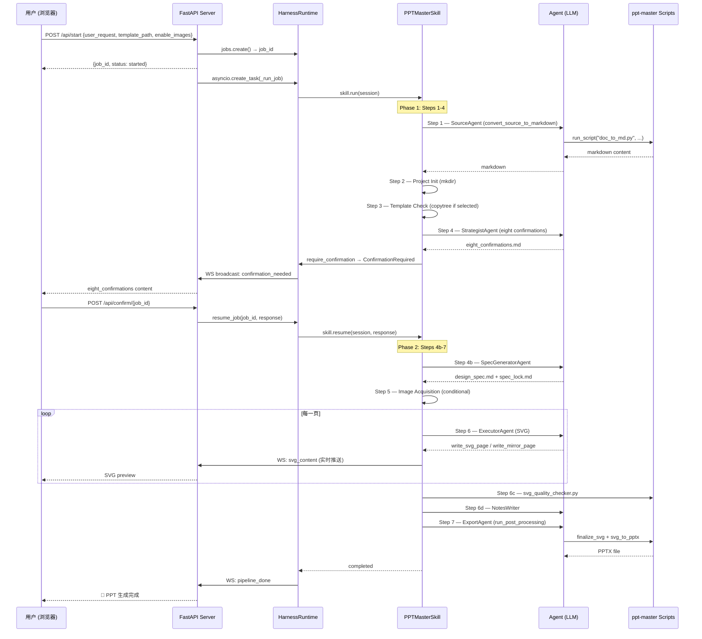

# Agent Harness MVP Specification

## 1. 项目目标

新建一个独立项目 `agent-harness`，保留现有 `demo` 不动。现有 `demo` 的前端后续可直接迁移或复用。

本项目目标是验证一种新的平台化架构：

```text
Harness Runtime + Skill + OpenAI Agent SDK Adapter
```

其中：

- **Harness Runtime** 负责 job 生命周期、事件流、确认点、artifact 管理和 skill 调度。
- **Skill** 是能力包，`ppt-master` 是第一个 skill。
- **OpenAI Agent SDK Adapter** 是短期可选后端，只负责执行 agent/tool loop，不负责平台状态。

长期目标是把系统从“PPT 生成应用”升级为“通用 Agent/Skill 平台”。

---

## 2. 背景与动机

当前 `demo` 项目已经实现了一部分 PPT 生成流水线，但存在几个架构问题：

1. **职责混杂**
   - `nodes.py` 同时负责流程编排、prompt 拼接、tool 调用、状态回传、Live Preview、Executor 逻辑等。

2. **LangGraph 不适合作为长期平台核心**
   - LangGraph 适合固定图状态机，但不适合表达 skill runtime、workflow gate、human-in-the-loop、standalone workflow、artifact lifecycle 等平台概念。

3. **OpenAI Agent SDK 不应管理平台状态**
   - OpenAI Agent SDK 可以作为 agent 执行后端，但不应该持有 job 状态、确认状态、artifact 状态。

4. **ppt-master 应作为 Skill 包运行，而不是被拆散复制**
   - 继续把 `ppt-master` 的 prompt、references、scripts 拆散集成，会导致能力残缺和维护成本上升。

因此，新项目采用 harness 思路，把 `ppt-master` 当作 skill 运行。

---

## 3. MVP 范围

### 3.1 MVP 要实现

第一版只验证平台最核心能力：

```text
用户输入主题
  ↓
PPTMasterSkill 生成 3 页 PPT 规划
  ↓
等待用户确认
  ↓
确认后逐页生成 SVG
  ↓
保存 artifacts
  ↓
生成 notes.md
  ↓
完成 job
```

MVP 覆盖能力：

| 能力 | 是否实现 |
|---|---|
| Skill 注册与加载 | 是 |
| Job 生命周期管理 | 是 |
| Event 事件记录 | 是 |
| Artifact 管理 | 是 |
| Human confirmation 暂停/恢复 | 是 |
| OpenAI Agent SDK Adapter | 是 |
| 简单 PPTMasterSkill | 是 |
| CLI 测试入口 | 是 |
| 最小 FastAPI API | 可选，建议同时实现 |

### 3.2 MVP 不实现

第一版暂不实现完整 `ppt-master` 能力：

- PDF/DOCX/PPTX/URL 源文件转换
- 完整 `project_manager.py` 项目结构
- 模板系统 `brand/layout/deck`
- Mirror 模式
- Live Preview
- PPTX 导出
- 图片生成与图片搜索
- Chart verify
- Visual review
- 多 skill marketplace
- 复用 demo 前端

这些放到后续阶段。

---

## 4. 目标目录结构

```text
agent-harness/
  README.md
  spec.md
  requirements.txt
  .env.example

  main.py                         # CLI MVP 测试入口
  server.py                       # FastAPI 最小 API，可选

  harness/
    __init__.py
    runtime.py                    # HarnessRuntime
    session.py                    # SkillSession
    skill.py                      # BaseSkill, SkillRegistry
    events.py                     # 事件模型与事件写入
    jobs.py                       # JobStore, Job 状态管理
    artifacts.py                  # ArtifactManager
    confirmations.py              # Confirmation 管理
    agent_adapters.py             # OpenAI Agent SDK Adapter

  skills/
    __init__.py
    ppt_master/
      __init__.py
      skill.yaml
      adapter.py                  # PPTMasterSkill
      agents.py                   # strategist_agent / executor_agent
      tools.py                    # write_svg_page / write_notes / save_plan

  data/
    jobs/
      <job_id>/
        state.json
        events.jsonl
        artifacts/
          plan.md
          svg_output/
            page_01.svg
            page_02.svg
            page_03.svg
          notes.md
```

---

## 5. 核心抽象

### 5.1 HarnessRuntime

`HarnessRuntime` 是平台入口，负责启动、恢复、查询 job。

```python
class HarnessRuntime:
    def __init__(self, skill_registry, job_store):
        ...

    async def start_job(
        self,
        skill_name: str,
        user_input: str,
        files: list[str] | None = None,
    ) -> str:
        ...

    async def resume_job(
        self,
        job_id: str,
        user_response: str,
    ) -> None:
        ...

    def get_job(self, job_id: str) -> dict:
        ...

    def get_events(self, job_id: str) -> list[dict]:
        ...
```

职责：

- 创建 job workspace
- 加载 skill
- 创建 `SkillSession`
- 调用 `skill.run(session)`
- 等待确认时暂停
- 用户确认后调用 `skill.resume(session, user_response)`
- 捕获异常并写入事件

---

### 5.2 SkillSession

`SkillSession` 是 skill 访问平台能力的唯一入口。

```python
class SkillSession:
    job_id: str
    skill_name: str
    workspace: Path
    user_input: str
    state: dict

    async def emit(self, event_type: str, **payload):
        ...

    async def require_confirmation(self, title: str, content: str):
        ...

    def artifact_path(self, relative_path: str) -> Path:
        ...

    def save_artifact(self, relative_path: str, content: str):
        ...
```

原则：

- Skill 不直接操作 WebSocket。
- Skill 不直接操作全局 job store。
- Skill 不直接依赖前端。
- Skill 通过 session 发事件、保存 artifact、请求确认。

---

### 5.3 BaseSkill

所有 skill 遵守统一接口。

```python
class BaseSkill:
    name: str

    async def run(self, session: SkillSession):
        raise NotImplementedError

    async def resume(self, session: SkillSession, user_response: str):
        raise NotImplementedError
```

`ppt-master` 是第一个实现。

---

### 5.4 SkillRegistry

负责注册和加载 skill。

```python
class SkillRegistry:
    def register(self, skill: BaseSkill):
        ...

    def get(self, name: str) -> BaseSkill:
        ...
```

未来可支持从 `skill.yaml` 自动加载。

---

### 5.5 OpenAI Agent SDK Adapter

OpenAI Agent SDK 只作为可替换后端。

```python
class OpenAIAgentSDKAdapter:
    async def run_agent(
        self,
        agent,
        input_text: str,
        max_turns: int = 5,
    ):
        ...
```

约束：

- 不管理 job 状态。
- 不管理 confirmation。
- 不管理 artifact。
- 不跨 step 保存隐式上下文。
- 每个 step 独立调用，避免 context overflow。

---

## 6. Job 生命周期

### 6.1 Job 状态

```text
queued
running
waiting_for_user
completed
failed
cancelled
```

终态集合固定为：

```text
completed
failed
cancelled
```

所有 runtime、server 兜底和前端展示逻辑必须通过统一终态判断，不允许在各处手写不同的状态集合。

### 6.2 Job state.json 示例

```json
{
  "job_id": "abc123",
  "skill": "ppt-master",
  "status": "waiting_for_user",
  "current_step": "confirmation",
  "created_at": "2026-05-24T21:45:00",
  "updated_at": "2026-05-24T21:46:00",
  "user_input": "帮我做一个3页PPT：商业银行并购管理",
  "state": {
    "plan_artifact": "plan.md"
  },
  "artifacts": [
    {
      "path": "plan.md",
      "type": "markdown"
    }
  ]
}
```

---

## 7. Event 模型

事件统一写入：

```text
data/jobs/<job_id>/events.jsonl
```

### 7.1 事件格式

```json
{
  "seq": 42,
  "ts": "2026-05-24T21:45:00",
  "type": "step_start",
  "message": "Strategist is creating the plan",
  "payload": {
    "step": "strategist"
  }
}
```

事件是 append-only 事实日志。`seq` 是 job 内单调递增序号，用于历史恢复、增量读取和前端去重。

### 7.2 事件类型

```text
job_started
step_start
step_done
agent_message
tool_call
tool_result
artifact_created
confirmation_required
job_waiting
job_resumed
job_completed
job_failed
job_cancelled
```

### 7.3 事件投影原则

WebSocket 与历史恢复必须共享同一个事件契约：

```text
events.jsonl ─┬─ GET /api/projects/{job_id}/events
              └─ WS /ws/progress/{job_id} -> { type: "harness_event", event }
```

后端不再维护一套“实时事件转换”和另一套“历史事件转换”。前端只有一个 `projectHarnessEvent()` 投影函数，将原始 HarnessEvent 转为：

- chat message
- log
- outline
- SVG artifact refresh
- phase/current step/result actions

新增事件类型时，优先扩展统一投影函数，避免协议分叉。

### 7.4 持久化可靠性

- `state.json` 必须使用临时文件 + rename 原子写。
- `events.jsonl` 每条事件写入后带 `seq`、flush、fsync。
- `SkillSession.emit()` 对关键事件自动同步 `current_step` 与 artifacts 到 job state。

---

## 8. Artifact 管理

Artifact 统一保存在：

```text
data/jobs/<job_id>/artifacts/
```

MVP 产物：

```text
plan.md
svg_output/page_01.svg
svg_output/page_02.svg
svg_output/page_03.svg
notes.md
```

后续可扩展：

```text
design_spec.md
spec_lock.md
images/
templates/
exports/*.pptx
backup/
```

---

## 9. PPTMasterSkill MVP 设计

### 9.1 skill.yaml

```yaml
name: ppt-master
description: Minimal PPT generation skill for harness MVP
version: 0.1.0
entrypoint: skills.ppt_master.adapter:PPTMasterSkill
requires:
  - llm
  - filesystem
  - artifacts
  - confirmation
```

### 9.2 run(session)

流程：

```python
async def run(self, session):
    await session.emit("step_start", step="strategist")

    plan = await strategist_agent.generate_plan(session.user_input)
    session.save_artifact("plan.md", plan)

    await session.emit("artifact_created", path="plan.md", type="markdown")
    await session.emit("step_done", step="strategist")

    await session.require_confirmation(
        title="确认 PPT 规划",
        content=plan,
    )
```

运行结果：

- 写入 `plan.md`
- Job 状态变成 `waiting_for_user`
- 等待用户确认

### 9.3 resume(session, user_response)

流程：

```python
async def resume(self, session, user_response):
    if "确认" not in user_response:
        # MVP 阶段可简单把用户修改意见附加到 plan，再继续或重新生成
        ...

    await session.emit("step_start", step="executor")

    for page in pages:
        svg = await executor_agent.generate_svg(page)
        session.save_artifact(f"svg_output/page_{page.num:02d}.svg", svg)
        await session.emit("artifact_created", path=...)

    notes = await executor_agent.generate_notes(pages)
    session.save_artifact("notes.md", notes)

    await session.emit("step_done", step="executor")
    await session.emit("job_completed")
```

---

## 10. MVP Agent 设计

### 10.1 Strategist Agent

输入：用户主题。

输出：Markdown 规划，固定三页。

示例：

```markdown
# PPT Plan

## Page 1: 封面
- Title: 商业银行并购管理
- Subtitle: 战略逻辑、流程与风险控制

## Page 2: 核心框架
- 并购动因
- 尽职调查
- 估值与交易结构
- 整合管理

## Page 3: 风险与建议
- 监管风险
- 文化整合风险
- 协同兑现风险
- 管理建议
```

### 10.2 Executor Agent

输入：单页 page plan。

输出：SVG string。

要求：

- `viewBox="0 0 1280 720"`
- 包含背景 rect
- 包含 title
- 包含内容块
- 使用简单商务风格
- 每页独立生成，避免上下文累积

---

## 11. CLI 测试入口

### 11.1 命令

```bash
python main.py "帮我做一个3页PPT：商业银行并购管理"
```

### 11.2 交互流程

```text
Job created: abc123
Strategist is creating plan...
Plan saved: data/jobs/abc123/artifacts/plan.md

=== Confirmation Required ===
[展示 plan.md 内容]
请输入确认或修改意见: 确认

Executor generating page 1...
Executor generating page 2...
Executor generating page 3...
Completed.
Artifacts: data/jobs/abc123/artifacts/
```

---

## 12. FastAPI 最小 API（建议）

### 12.1 Start Job

```http
POST /api/jobs
Content-Type: application/json

{
  "skill": "ppt-master",
  "input": "帮我做一个关于商业银行并购管理的三页PPT"
}
```

返回：

```json
{
  "job_id": "abc123",
  "status": "running"
}
```

### 12.2 Get Job

```http
GET /api/jobs/{job_id}
```

返回：

```json
{
  "job_id": "abc123",
  "skill": "ppt-master",
  "status": "waiting_for_user",
  "current_step": "confirmation",
  "artifacts": []
}
```

### 12.3 Confirm

```http
POST /api/jobs/{job_id}/confirm
Content-Type: application/json

{
  "response": "确认"
}
```

### 12.4 Events

```http
GET /api/jobs/{job_id}/events
```

第一版先用 HTTP 轮询，后续再加 WebSocket。

---

## 13. 依赖

`requirements.txt`：

```text
python-dotenv>=1.0.0
fastapi>=0.110.0
uvicorn>=0.27.0
openai-agents>=0.0.14
pydantic>=2.0.0
```

如果本地已有 `openai-agents-python-main`，也可以用本地 editable 安装。

---

## 14. 环境变量

`.env.example`：

```text
OPENAI_API_KEY=your_api_key_here
OPENAI_MODEL=gpt-4.1-mini
DATA_DIR=./data
```

---

## 15. 验收标准

MVP 成功条件：

1. 可以运行：

   ```bash
   python main.py "帮我做一个3页PPT：商业银行并购管理"
   ```

2. 创建 job 目录：

   ```text
   data/jobs/<job_id>/
   ```

3. 生成：

   ```text
   artifacts/plan.md
   ```

4. 程序进入确认等待。

5. 输入 `确认` 后继续执行。

6. 生成：

   ```text
   artifacts/svg_output/page_01.svg
   artifacts/svg_output/page_02.svg
   artifacts/svg_output/page_03.svg
   artifacts/notes.md
   ```

7. `events.jsonl` 记录完整过程。

8. `state.json` 最终状态为：

   ```json
   {
     "status": "completed"
   }
   ```

---

## 16. 后续阶段

### Phase 1：Harness MVP

实现本文档描述的最小产品。

### Phase 2：迁移真实 ppt-master 主流程

逐步接入：

- source processing
- project init
- template option
- strategist eight confirmations
- design_spec/spec_lock generation
- image acquisition
- executor
- export

### Phase 3：复用 demo 前端

将 demo 前端 API 从：

```text
/api/start
/api/status/{job_id}
/api/confirm/{job_id}
/ws/progress/{job_id}
```

迁移为：

```text
/api/jobs
/api/jobs/{job_id}
/api/jobs/{job_id}/confirm
/api/jobs/{job_id}/events
```

前端界面可以基本保留。

### Phase 4：多 Skill 平台

新增：

```text
skills/research
skills/data_analysis
skills/report_writer
skills/code_agent
```

形成通用 Agent/Skill 平台。

---

## 17. 关键原则

1. **demo 不动**
   - 新项目独立创建。
   - demo 前端后续复用。

2. **Harness 管平台状态**
   - Job、event、artifact、confirmation 都由 harness 管。

3. **OpenAI Agent SDK 只是 adapter**
   - 不让 SDK 管平台生命周期。
   - 后续可以替换成自研 ToolLoop。

4. **Skill 是能力包**
   - `ppt-master` 是第一个 skill，不是硬编码应用逻辑。

5. **每个 step 独立上下文**
   - 避免 context window overflow。

6. **先验证最小闭环，再迁移完整能力**
   - 不一次性复刻全部 ppt-master。

---

## 18. 系统架构（当前实现）

> 以下内容反映 Phase 2 完成后的实际架构。

### 18.1 整体架构

```
┌─────────────────────────────────────────────────────────────────────┐
│                        React Frontend (Vite)                        │
│   IdleLayout ─ ChatMessages ─ SvgPreview ─ ConfirmationPanel       │
│          ↑ REST/WS                                                  │
├─────────┬───────────────────────────────────────────────────────────┤
│  HTTP   │  WebSocket                                                │
│  API    │  /ws/progress/{job_id}                                    │
├─────────┴───────────────────────────────────────────────────────────┤
│                    FastAPI Server  (server.py)                       │
│   Routes │ WS Manager │ Event Transform │ Static Files              │
├─────────────────────────────────────────────────────────────────────┤
│                    Harness Runtime Layer                             │
│  ┌──────────┐ ┌──────────┐ ┌────────┐ ┌───────────┐ ┌───────────┐ │
│  │ Runtime  │ │ Session  │ │  Jobs  │ │  Events   │ │ Artifacts │ │
│  │          │ │          │ │ Store  │ │ (JSONL)   │ │  Manager  │ │
│  └─────┬────┘ └────┬─────┘ └───┬────┘ └─────┬─────┘ └─────┬─────┘ │
├────────┼───────────┼───────────┼─────────────┼─────────────┼───────┤
│        │    Skill Interface (BaseSkill)       │             │       │
│        ▼           ▼                          ▼             ▼       │
│  ┌──────────────────────────────────────────────────────────────┐   │
│  │              PPTMasterSkill  (adapter.py)                    │   │
│  │  _step_source_processing  →  _step_project_init             │   │
│  │  _step_template_check     →  _step_strategist               │   │
│  │  ── confirmation pause ──                                    │   │
│  │  _step_generate_spec      →  _step_image_acquisition        │   │
│  │  _step_executor           →  _step_quality_check            │   │
│  │  _step_speaker_notes      →  _step_export                   │   │
│  └──────────┬───────────────────────────────────────────────────┘   │
│             │                                                       │
│             ▼                                                       │
│  ┌──────────────────────┐  ┌────────────────────────────────────┐   │
│  │ OpenAI Agent Adapter │  │  ppt-master Scripts (Python)       │   │
│  │ (agents SDK Runner)  │  │  source_to_md/ project_manager     │   │
│  │                      │  │  svg_quality_checker finalize_svg   │   │
│  │  source_agent        │  │  svg_to_pptx  image_gen            │   │
│  │  research_agent      │  │  pptx_template_import              │   │
│  │  strategist_agent    │  └────────────────────────────────────┘   │
│  │  spec_generator_agent│                                           │
│  │  image_agent         │  ┌────────────────────────────────────┐   │
│  │  executor_agent      │  │  DeepSeek / OpenAI API             │   │
│  │  notes_agent         │  │  (configurable LLM backend)        │   │
│  │  export_agent        │  └────────────────────────────────────┘   │
│  └──────────────────────┘                                           │
└─────────────────────────────────────────────────────────────────────┘
```

### 18.2 模块职责

| 模块 | 文件 | 职责 |
|------|------|------|
| **Server** | `server.py` | HTTP/WS 入口、路由、静态文件、事件转换 |
| **Runtime** | `harness/runtime.py` | Job 生命周期、Session 构建、WS 回调绑定 |
| **Session** | `harness/session.py` | Skill 的唯一平台接口：emit / artifact / confirmation |
| **JobStore** | `harness/jobs.py` | 文件型 Job 持久化 (`state.json`) |
| **EventWriter** | `harness/events.py` | JSONL 追加写入 + 异步 WS 回调 |
| **ArtifactManager** | `harness/artifacts.py` | 产物读写 (`artifacts/` 目录) |
| **WS Manager** | `harness/ws_manager.py` | 按 job_id 管理 WebSocket 连接 |
| **Skill** | `skills/ppt_master/adapter.py` | 7 步流水线编排（已拆为独立 step 函数） |
| **Agents** | `skills/ppt_master/agents.py` | 8 个 Agent 定义 (OpenAI Agents SDK) |
| **Tools** | `skills/ppt_master/tools.py` | 20+ function_tool，封装 ppt-master 脚本 |
| **Config** | `skills/ppt_master/config.py` | 路径、LLM Provider、脚本运行器 |

### 18.3 数据流 — 完整 PPT 生成



### 18.4 目录结构（当前）

```text
agent-harness/
├── server.py                          # FastAPI 入口 (~870 行)
├── main.py                            # CLI 测试入口
├── spec.md                            # 本文档
├── requirements.txt
├── .env
│
├── harness/                           # 平台层 (skill-agnostic)
│   ├── runtime.py                     #   Job lifecycle
│   ├── session.py                     #   Skill ↔ Platform interface
│   ├── skill.py                       #   BaseSkill + SkillRegistry
│   ├── jobs.py                        #   File-backed JobStore
│   ├── events.py                      #   JSONL EventWriter
│   ├── artifacts.py                   #   ArtifactManager
│   ├── confirmations.py               #   ConfirmationRequired exception
│   ├── agent_adapters.py              #   OpenAI Agents SDK wrapper
│   └── ws_manager.py                  #   WebSocket ConnectionManager
│
├── skills/ppt_master/                 # PPT Master skill
│   ├── adapter.py                     #   PPTMasterSkill (thin orchestrator)
│   │                                  #   + 10 独立 step 函数
│   ├── agents.py                      #   8 Agent 定义
│   ├── tools.py                       #   20+ function_tool
│   └── config.py                      #   路径、LLM、script runner
│
├── web/                               # React 前端 (Vite + TailwindCSS)
│   └── src/
│       ├── store.ts                   #   Zustand 状态管理
│       ├── ws.ts                      #   WebSocket 客户端
│       ├── api.ts                     #   REST API 调用
│       └── layouts/
│           ├── IdleLayout.tsx         #   输入界面 + 模板选择
│           └── ...
│
└── data/
    ├── jobs/{job_id}/                 # 每个 Job 的数据
    │   ├── state.json                 #   Job 持久化状态
    │   ├── events.jsonl               #   事件流
    │   ├── artifacts/                 #   产物 (MD/SVG/PPTX)
    │   └── project/                   #   ppt-master 项目目录
    │       ├── sources/
    │       ├── templates/
    │       ├── svg_output/
    │       ├── images/
    │       ├── notes/
    │       └── exports/
    └── custom_templates/              # 用户上传的自定义模板
```

### 18.5 API 路由总览

| Method | 路径 | 功能 |
|--------|------|------|
| POST | `/api/upload` | 上传源文件 |
| POST | `/api/upload_url` | URL 源注册 (stub) |
| GET | `/api/templates` | 列出所有模板 |
| POST | `/api/templates/custom/upload` | 上传自定义 PPTX 模板 |
| DELETE | `/api/templates/custom/{id}` | 删除自定义模板 |
| POST | `/api/start` | 启动 PPT 生成流水线 |
| GET | `/api/status/{job_id}` | 查询 Job 状态 |
| POST | `/api/confirm/{job_id}` | 确认/修改设计方案 |
| GET | `/api/download/{job_id}` | 下载 PPTX |
| GET | `/api/projects/{job_id}/svgs` | 列出 SVG 页面 |
| GET | `/api/projects/{job_id}/svg/{page}` | 获取单页 SVG |
| GET | `/api/projects/{job_id}/notes` | 获取演讲稿 |
| GET | `/api/projects/{job_id}/spec` | 获取设计文档 |
| GET | `/api/projects/{job_id}/events` | 获取历史事件 (chat replay) |
| GET | `/api/jobs` | Job 历史列表 |
| DELETE | `/api/jobs/{job_id}` | 删除 Job |
| GET | `/api/health` | 健康检查 |
| WS | `/ws/progress/{job_id}` | 实时进度推送 |

### 18.6 PPT 生成流水线 — 7 步

| 阶段 | Step 函数 | Agent | 说明 |
|------|-----------|-------|------|
| **1** | `_step_source_processing` | SourceAgent / ResearchAgent | 文件转 MD 或话题调研 |
| **2** | `_step_project_init` | — | 创建目录结构、保存 content.md |
| **3** | `_step_template_check` | — | 模板解析、Mirror 模式判定、copytree |
| **4** | `_step_strategist` | StrategistAgent | 八项确认设计方案 |
| | *confirmation pause* | | 用户确认 / 修改 |
| **4b** | `_step_generate_spec` | SpecGeneratorAgent | 生成 design_spec.md + spec_lock.md |
| **5** | `_step_image_acquisition` | ImageAgent | AI 配图 (用户 opt-in) |
| **6** | `_step_executor` | ExecutorAgent | 逐页生成 SVG (Mirror / 标准) |
| **6c** | `_step_quality_check` | — | SVG 质量检查脚本 |
| **6d** | `_step_speaker_notes` | NotesWriter | 生成演讲稿 |
| **7** | `_step_export` | ExportAgent | finalize + svg_to_pptx 导出 |

### 18.7 关键设计决策

1. **Step 函数独立** — 每个 step 是独立 async 函数，`PPTMasterSkill` 类只是薄编排层，便于单步调试和测试。

2. **Agent 无状态** — 每次 `adapter.run_agent()` 都是独立调用，不累积上下文，避免 token overflow。

3. **Mirror 模式** — 有模板时复用模板 SVG + 文字替换，无模板时 AI 从零生成 SVG。

4. **事件双写** — 每个事件同时写入 `events.jsonl`（持久化）和 WS 广播（实时推送），保证历史可重放。

5. **Confirmation 异常控制流** — `require_confirmation()` 抛出 `ConfirmationRequired` 异常，被 Runtime 捕获暂停 Job，用户确认后调用 `resume()`。

6. **LLM 可配置** — 通过环境变量切换 DeepSeek / OpenAI / 其他兼容 API。


---

## 19. 平台化与工业级重构方案 (Phase 5: Production & Platformization)

为了让 Harness 彻底升级为**通用的 Agent 平台（多 Skill 共存）**，并解决现有的工程化隐患，我们在 Phase 5 启动系统级重构。

### 19.1 技能与平台层彻底解耦 (Skill-Agnostic Core)

#### 1. 统一的技能基类 `BaseSkill` 升级
所有的 Skill（如 `ppt_master`, `research`, `data_analysis`）必须继承统一基类，使用统一的上下文入参：

```python
# harness/skill.py
from pydantic import BaseModel
from typing import Any, Protocol

class SkillMetadata(BaseModel):
    name: str
    description: str
    version: str
    supported_ui_types: list[str]  # e.g., ["svg_slides", "code_editor", "interactive_table"]

class BaseSkill(Protocol):
    metadata: SkillMetadata
    
    async def run(self, session: "SkillSession") -> None:
        """运行 Skill。如果中途需要用户确认，抛出 ConfirmationRequired 异常。"""
        ...
        
    async def resume(self, session: "SkillSession", user_response: str) -> None:
        """用户反馈后恢复 Skill。"""
        ...
```

#### 2. 工具统一注册器 (Tool Registry)
不再允许技能脚本中杂乱硬编码工具，提供平台级工具管理器：

```python
# harness/tools.py
from typing import Callable, Any

class ToolRegistry:
    def __init__(self):
        self._tools: dict[str, dict[str, Any]] = {}

    def register(self, name: str, func: Callable, description: str):
        self._tools[name] = {"func": func, "description": description}

    def get_tools_for_skill(self, skill_name: str) -> list[Callable]:
        # 动态根据当前 Skill 的注入需要，返回一组合规工具
        ...
```

### 19.2 高性能工程化：并发 SVG 生成与流式控制

#### 1. 并发生成逻辑 (Concurrency Control)
将原本 `_step_executor` 的串行循环修改为受限的异步并发控制（Asyncio Semaphore），以防止 LLM 发生 API Rate Limit 报错，同时提升生成速度 3-5 倍：

```python
# skills/ppt_master/adapter.py 示例演进
import asyncio

async def _step_executor_concurrent(session: "SkillSession", page_outline: list[dict], ...):
    sem = asyncio.Semaphore(3)  # 最大 3 并发
    
    async def generate_single_page(page_info):
        async with sem:
            # 1. 构造 prompt 
            # 2. 调用 run_agent 
            # 3. 兜底与 emit
            await session.emit("page_generating", page=page_info["num"])
            # ...
            
    # 并行等待所有页面生成完成
    await asyncio.gather(*(generate_single_page(p) for p in page_outline))
```

#### 2. 文件锁防竞态脏写 (State Locking)
多任务高并发情况下，Harness 的文件读写（如更新 `state.json`）可能产生竞态，重构为基于 `asyncio.Lock` 保证操作原子性：

```python
# harness/jobs.py 升级
import asyncio

class JobStore:
    def __init__(self, data_dir: str):
        self.locks: dict[str, asyncio.Lock] = {}
        
    def get_lock(self, job_id: str) -> asyncio.Lock:
        if job_id not in self.locks:
            self.locks[job_id] = asyncio.Lock()
        return self.locks[job_id]

    async def update_job(self, job_id: str, fields: dict):
        async with self.get_lock(job_id):
            # 执行原子性 state.json 写入
            ...
```

### 19.3 多模态视觉校验闭环 (VQA QC Loop)

引入 **LLM 多模态视觉校验（Visual QA Quality Checker）** 代替纯静态 XML 解析：

```text
生成的 SVG ────────> 转换为 PNG/WebP ────────> 发送至 GPT-4o-mini/Sonnet (多模态)
                             │                                 │
                             ▼                                 ▼
                     视觉无重叠，色彩协调 <─────── QC 校验：判断文字是否溢出或遮挡
```

1. **多模态 Prompt 指导**：
   - 提取 SVG 的 base64 图像后发送给 LLM。
   - 询问 LLM：“当前页面是否出现文字错位、元素层级重合、对比度极低等视觉逻辑错误？”。
2. **错误自愈**：
   - 如果视觉校验失败，多模态给出视觉诊断报告（e.g., `"标题和副标题重叠"`）。
   - 将报告作为 Retry Prompt 驱动 `_step_quality_check` 进行自适应局部位置调整。

### 19.4 UI 模块化与卡片流 (Plugin-based UI)

前端 React / TypeScript 消除与 `ppt-master` 的强耦合，向通用 Agent 平台迈进。

#### 1. 前端布局适配器 (Artifact View Adapter)
前端依据当前 Job 注册的 Skill 所声明的 `supported_ui_types`，动态决定主面板渲染器：

```typescript
// web/src/components/ArtifactRenderer.tsx
import { SvgSlidePreview } from './skills/SvgSlidePreview'
import { CodeEditorView } from './skills/CodeEditorView'
import { DataTableView } from './skills/DataTableView'

export function ArtifactRenderer({ uiType, artifactPath }) {
  switch (uiType) {
    case 'svg_slides':
      return <SvgSlidePreview path={artifactPath} />
    case 'code_editor':
      return <CodeEditorView path={artifactPath} />
    case 'interactive_table':
      return <DataTableView path={artifactPath} />
    default:
      return <DefaultMarkdownView path={artifactPath} />
  }
}
```

#### 2. 会话流卡片插拔 (Card-based Chat Flow)
在 WebSocket 消息传递中引入自定义卡片 `card_type`：
- 当接收到 `step_start` / `confirmation` 事件时，不只推文字，还推具有对应交互的 JSON 声明，前端依据 JSON 绘制带确认、输入、滑块选择的**交互卡片组件**。

